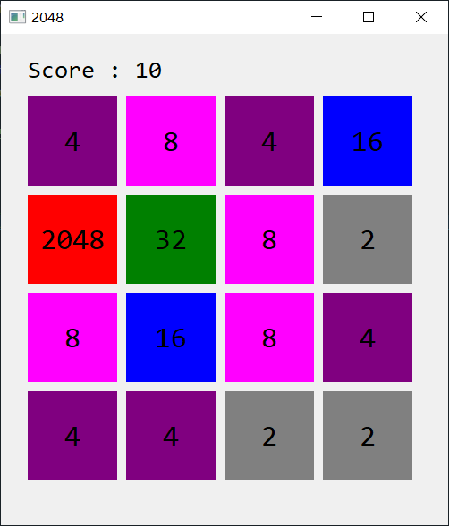
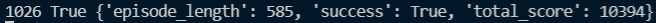

# MCTS 2048

Use  Monte-Carlo Tree Search(MCTS) method to build an agent which is capable of playing the game 2048.

Run `game2048.py` to play.

Set the parameters of MCTS in line 333~338 where `c` is the explore constant, `gamma` is discount, `maxDepth` is for simulate and roll out and `resource` limits the iterations for simulate.

## Results

When `c = 150, gamma = 0.98, maxDepth = 30, resource = 200`, the agent makes it!

